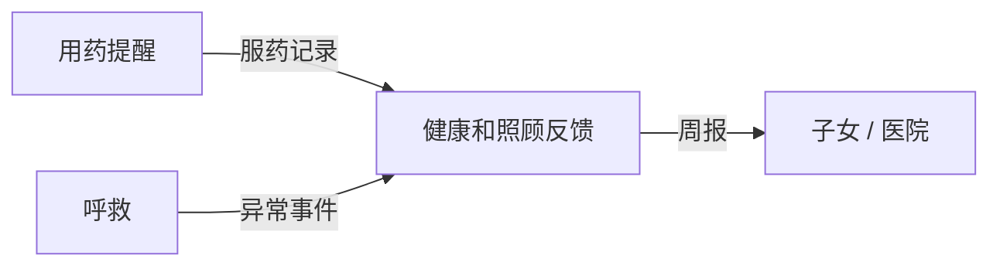

# 老人语音助手 · Skill 库

面向独居老人的语音助手。老人说一句话，系统转成文字，由大模型判断意图，
调用对应的 skill 并校验参数，最后把结果念回给老人。

```
老人语音 → ASR 转文字 → Agent 判断意图/风险 → 调用 skill → 参数校验 → 执行 → 语音反馈
```

---

## 一、三个人的分工

| 模块 | 文件夹 | 谁在做 | 状态 |
|---|---|---|---|
| **用药提醒** | `skills/medication_reminder/` | （填名字） | ✅ 已完成，待优化 |
| **呼救** | `skills/emergency_call/` | （填名字） | ✅ Skill 已实现，真实通知发送待接入 |
| **健康和照顾反馈** | `skills/health_report/` | （填名字） | ✅ Skill 已实现，跨模块事件流待接入 |
| **共享契约层** | `common/` | 三个人一起 | ⚠️ 草案待定稿 |

> 📌 每个 skill 文件夹下都有一份 `README.md`，写清了那个模块要做什么、怎么开工。
> 动手前可以先看自己那份。

### 三个模块的依赖关系（重要）

它们不是平行的，是有数据依赖的：



所以**健康和照顾反馈在数据上是下游**，它的数据源是另外两个 skill 的产出。
这就是为什么要有共享层 `common/`。

### 协作方式：平等，不需要审批

| 事项 | 我们的做法 |
|---|---|
| 分支 | **不用建分支，三个人都直接推 `main`** |
| 冲突 | 自动发现已经消灭了最大的冲突源 |
| 谁批准 | **不需要任何人批准** |
| 我们的约定 | 开工前 `git pull`，提交前跑 `pytest` |
| 注册新 skill | 自己包里写 `SKILL = YourSkill()`，**不用改公共文件** |

详见 `CONTRIBUTING.md`。

---

## 二、目录结构

```
.
├── common/                       # ★ 共享契约层（三个人一起用，改动前说一声）
│   ├── base.py                   #   BaseSkill / SkillResult / SkillContext / RiskLevel
│   ├── registry.py               #   注册表：程序查表、导出 Qwen schema
│   ├── domain.py                 #   数据实体 Person / MedicationLog / Incident / Notification
│   └── timefmt.py                #   时间口语化：08:00 → 「早上 8 点」
│
├── skills/                       # 各 skill 自己的目录
│   ├── __init__.py               #   自动发现（★ 谁都不需要改这个文件）
│   ├── medication_reminder/      #   ← 用药提醒
│   ├── emergency_call/           #   ← 呼救（含 README 说明能力和接入边界）
│   └── health_report/            #   ← 健康和照顾反馈（含 README 说明怎么开工）
│
├── tests/                        # 测试
├── docs/
│   ├── 上手指南.md                #   ★ 第一次动手看这份（4 步 10 分钟）
│   ├── 接口约定.md                #   ★ 三个人一起约定的接口
│   ├── 网络与Git配置.md            #   推送失败时看（国内直连 GitHub 常失败）
│   └── reference/                #   项目规划截图
│
├── .github/
│   ├── CODEOWNERS                #   ⚠️ 需替换成真实 GitHub 用户名
│   ├── pull_request_template.md
│   └── workflows/ci.yml          #   PR 自动跑测试
│
├── README.md                     # 本文件
├── CONTRIBUTING.md               # ★ Git 协作规范（分支、提交、冲突处理）
├── demo.py                       # 端到端演示（不接真实 Qwen 也能跑）
├── qwen_tools.py                 # 导出 Qwen 的 tools JSON
├── pyproject.toml
└── requirements.txt
```

---

## 三、当前能完成什么

`skills` 会自动发现并注册三个 skill；`qwen_tools.py` 可导出各动作的 Qwen 工具定义。
当前实现的是业务逻辑库，`demo.py` 使用预设的工具调用演示流程。

| Skill | 当前动作 | 实际效果 |
|---|---|---|
| 用药提醒 | `create` / `query` / `update` / `cancel` / `confirm_taken` | 管理用药计划，查询安排并记录服药情况；定时播报还需要上层调度器 |
| 呼救 | `trigger` / `check_progress` / `cancel` / `confirm_safe` | 立即记录呼救并生成待发送通知；查询已写入的救助状态；确认后取消或报平安 |
| 健康和照顾反馈 | `generate_weekly` / `send_report` / `query_archive` / `query_summary` | 汇总注入的服药和异常事件数据，生成周报、档案及待发送通知 |

**呼救接入边界：** `trigger` 不要求先补齐原因和地点，也不做二次确认。
它会返回 `Incident` 和 `Notification`，但仓库目前没有电话、短信或微信出站服务，
因此执行 skill 本身不会拨打 120，也不代表家属或救助人员已收到消息。
进度须由上层根据真实反馈调用 `EmergencyCallExecutor.update_status()` 更新。
事件默认保存在本地 JSON 文件；跨模块共享事件流仍需接线。
详见 [呼救模块说明](skills/emergency_call/README.md)。

## 四、快速开始

```bash
pip install -r requirements.txt

python -m pytest        # 跑全量测试
python demo.py          # 看完整链路演示（8 个场景）
```

环境：Python 3.10+（开发用 3.12）+ Pydantic 2.x，没有其它依赖。

### 常用命令

```bash
python qwen_tools.py            # 导出 Qwen 的 tools 数组
python qwen_tools.py --index    # 只导出 skill 清单（塞 system prompt 用）
python qwen_tools.py --write    # 写到 data/qwen_tools.json

python -c "import skills; print([s.name for s in skills.all_skills()])"   # 看注册了哪些 skill
```

---

## 五、从哪开始

| 情况 | 建议先看 |
|---|---|
| **第一次动手** | 📄 `docs/上手指南.md`（4 步 10 分钟，只讲怎么开始） |
| **了解呼救或接入通知服务** | 再读 `skills/emergency_call/README.md` |
| **写健康和照顾反馈** | 再读 `skills/health_report/README.md`，⚠️ 共享事件流怎么读这块建议先和另外两人对上 |
| **所有人** | 写代码前看 `docs/接口约定.md`（一起约定的接口） |

### 上手最快的路径

1. 跑一遍 `python demo.py`，理解整条链路
2. 读 `common/base.py` 的注释，理解一个 skill 长什么样
3. 打开 `skills/medication_reminder/schema.py`，看参数模型和校验规则怎么写
4. 复制 `medication_reminder/` 的 5 个文件到自己文件夹，改造成自己的业务

**从零开始写会比较慢**——照着 `medication_reminder` 的结构走，比较容易和大家对上。

---

## 六、核心设计（为什么这么写）

### 1. 一份定义，两边使用

参数模型用 Pydantic 写一次，同时服务两个用途：

| 用途 | 方式 |
|---|---|
| 程序校验参数 | `Model.model_validate(...)` |
| 生成 Qwen 的 tool schema | `Model.model_json_schema()` |

**所以字段的 `description` 是写给 Qwen 看的，不是注释。**
Qwen 填参准不准，直接取决于这段文字写得好不好。

### 2. 一个 skill 拆成多个 tool

规划里说「Qwen 选择一个 skill」，但实现上一个 skill 会导出成多个 tool：

```
medication_reminder_create / _query / _update / _cancel / _confirm_taken
```

原因：如果用「一个大参数模型 + 一个 action 字段」，Qwen 会看到一堆
「只有某个 action 才必填」的字段，实测容易漏填。拆成独立 tool 后
`required` 变得稳定，填参准确率高很多。但仍然保持「一个 skill」的粒度，符合规划。

### 3. 参数校验分两层

- **第一层**：Pydantic 管类型、范围、必填、枚举
- **第二层**：`model_validator` 管跨字段规则

跨字段规则是最容易出错的地方，比如「说一天吃三次，却只给了两个时间点」——
这类错误交给程序拦住比较可靠，指望 Qwen 自己发现不太稳妥。

**校验失败不是报错崩掉，而是转成一句追问话术**回给老人。
因为老人说的信息本来就常常不全，追问是正常流程，不是异常。

### 4. 已经踩过的坑

| 坑 | 处理方式 |
|---|---|
| Pydantic 把枚举输出成两层 `$ref`，Qwen 读不全 | `flatten_schema()` 展平 |
| 字段名叫 `date` 会遮蔽 `datetime.date` 类型 | 用 `DateType` 别名 |
| 把 `2026-09-19` 直接念给老人听 | `timefmt.day_cn()` → 「今天」 |
| 靠报错文本猜是哪个字段错了会猜错 | 用 Pydantic 的 `loc` 精确定位 |

---

## 七、当前待办

### 🔴 需要一起定的事（越早越好）

- [x] `Person.id` 的规则 —— 已定稿：改名为 `person_id`，用稳定字符串 ID（如 `elder_01`）
- [x] 共享事件流存哪、怎么读 —— 已落地：`common/event_store.py` 的 `EventStore`（JSONL）
      （用药提醒和呼救往这里写，健康反馈用 `medication_logs()` / `incidents()` 读）
- [ ] 把 `CODEOWNERS` 里的占位用户名换成真实 GitHub 用户名

### 🟠 待办

- [x] `SkillResult` 增加 `confirm_level` / `notifications` 字段 —— 已定稿，
      三个 skill 已统一改用一等字段（不再散落 `require_confirm_back` / `notify_family`）
- [x] 用药提醒的 `taken_log` 改成完整事件流（含漏服记录）—— 已完成，
      漏服在超过 60 分钟时由调度器落库（`MISSED_AFTER_MIN`）
- [ ] 把 `Reminder.taken_log` 和 `EmergencyStore` 的写入接到 `common/event_store.py` 的
      统一事件流（目前事件流类是独立的，三个 skill 还没往里面写，属于「接线」）
- [ ] 接入呼救通知出站服务及送达确认、重试；将真实救助进度回写事件

### 🟡 后期

- [ ] 真实 Qwen 接入（用 `qwen_tools.py --write` 的输出拼 DashScope 的 tools 参数）
- [ ] 存储换成数据库
- [ ] 定时调度器（每分钟调 `due_reminders()`，负责播报和去重）
- [ ] 药品名标准化（老人说「降压药」，需要别名表映射到具体药名）
- [ ] 药物相互作用检查（医疗安全，建议后期做）

---

## 八、文档索引

| 文档 | 什么时候看 |
|---|---|
| `docs/上手指南.md` | ⚠️ **第一次动手看这份**（4 步搞定 SSH + clone + 日常流程） |
| `docs/网络与Git配置.md` | 推送失败时看（含报错对照表和自查清单） |
| `docs/接口约定.md` | 写代码前必看，三人契约 |
| `CONTRIBUTING.md` | 遇到冲突、想了解提交规范时看 |
| `skills/*/README.md` | 开工前看自己那份 |
| `common/domain.py` 的注释 | 需要老人/事件/通知这些实体时 |
