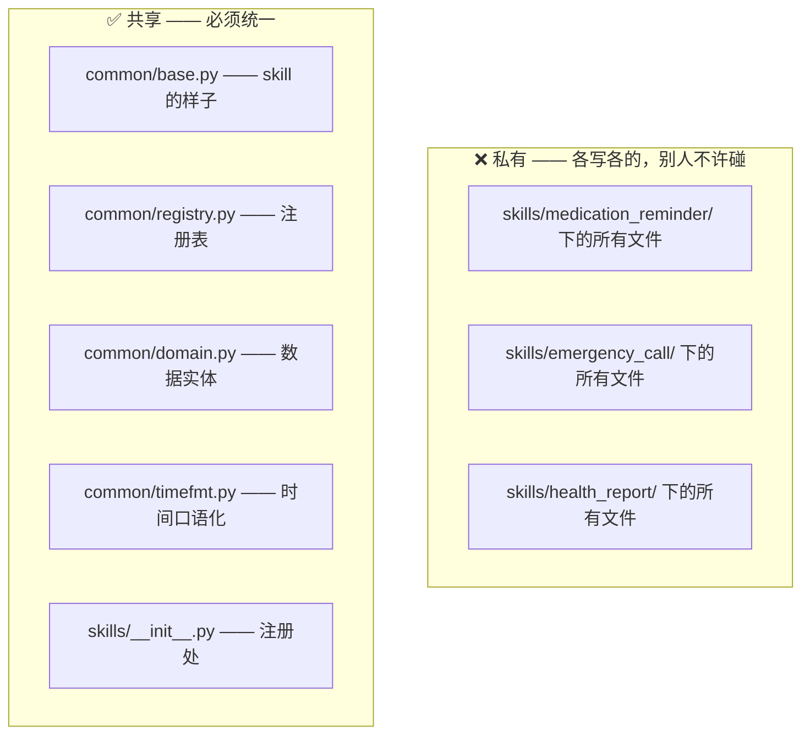

# 接口约定

> 三个人都必须遵守。**改这个文档里的任何内容 = 改代码契约**，需要三人同意。

---

## 一、什么必须统一，什么不用

判断标准只有一条：**这个数据会不会流向别人？**



| 内容 | 是否统一 | 原因 |
|---|---|---|
| `BaseSkill` / `SkillResult` / `SkillContext` | ✅ **必须** | Agent 层要统一调度 |
| 数据实体（老人 / 服药 / 事件 / 通知） | ✅ **必须** | 健康反馈组要读另外两组的数据 |
| `timefmt` 时间格式化 | ✅ **必须** | 否则同一个时间三种说法 |
| skill 注册方式 | ✅ **必须** | 注册表只有一个 |
| 各自的参数模型（`schema.py`） | ❌ 不用 | 业务对象根本不同 |
| 各自的话术（`messages.py`） | ❌ 不用 | 呼救要紧迫，周报要正式，语气天然不同 |
| 各自的业务逻辑（`executor.py`） | ❌ 不用 | 各写各的 |
| 各自的存储（`store.py`） | ❌ 不用 | 但**职责要分清**，见第四节 |

---

## 二、Skill 必须长成什么样

```python
from common import BaseSkill, RiskLevel, SkillContext, SkillResult

class XxxSkill(BaseSkill):
    name = "xxx"                    # ★ 英文小写下划线，定了就不许改
    display_name = "中文名"
    description = "写清楚什么话该触发我，这段会进 Qwen 的 prompt"
    risk_level = RiskLevel.MEDIUM

    ACTIONS = {
        "some_action": SomeParamsModel,   # {action名: Pydantic 模型}
    }

    def execute(self, action, params, ctx) -> SkillResult:
        # 必须返回 SkillResult，不许抛异常
        ...

    def followup_for(self, action, exc, field_name="") -> str:
        # 参数校验失败时，生成一句老人听得懂的追问
        ...
```

### 关于 `name` 的一条铁律

`name` 会同时出现在：Qwen 的 prompt、日志、数据库、前端。
**一旦写进代码就不能再改**，改了等于所有历史数据对不上。所以：

| skill | name（已定，不许改） |
|---|---|
| 用药提醒 | `medication_reminder` |
| 呼救 | `emergency_call` |
| 健康和照顾反馈 | `health_report` |

tool 名自动生成，格式固定 `{skill}_{action}`，例如 `medication_reminder_create`。**不要自己拼**。

---

## 三、`SkillResult` —— 上层唯一认识的东西

Agent 层只认这个结构，不会去判断「这是哪个 skill」。

| 字段 | 谁填 | 说明 |
|---|---|---|
| `ok` | skill | 是否成功 |
| `skill` / `action` | skill | 自动带上，方便日志 |
| `speech` | skill | **要念给老人听的话**。TTS 直接播这句，不要在里面放英文 |
| `data` | skill | 结构化结果，给日志/前端/调试用 |
| `need_followup` | skill | 参数不全，需要 Qwen 追问老人 |
| `followup_question` | skill | 追问话术 |
| `error` | skill | 出错详情，**只给开发者看，不要念给老人** |

### 三个铁律

1. **老人听到的每一句话都从 `speech` 走**，不要在别处拼字符串。
2. **`speech` 里不许出现英文、ISO 日期（2026-09-19）、技术术语。**
   要说「今天」「早上 8 点」，不能说 `08:00:00` 或 `2026-09-19`。
   → 用 `common/timefmt.py`
3. **`execute()` 不许把异常抛出去**。基类已经兜底了，但你自己也要注意。

---

## 四、数据实体的归属（重要）

存储要分职责，否则健康反馈组读不到数据：

| 数据 | 存哪 | 谁写 | 谁读 |
|---|---|---|---|
| 提醒设置、呼救联系人配置 | 各 skill 自己的 store | 自己 | 只有自己 |
| **服药记录** `MedicationLog` | 共享事件流 | 用药提醒 | 健康反馈 |
| **异常事件** `Incident` | 共享事件流 | 呼救 + 用药提醒 | 健康反馈 |
| **通知** `Notification` | 出站队列 | 三个都写 | 出站层 |

### 🚫 明令禁止

```python
# 不许这样！这是耦合，别人改一下你的代码就崩
from skills.medication_reminder.store import ReminderStore
```

```python
# 要这样：只从共享层导入
from common.domain import MedicationLog, Incident
```

---

## 五、通知：不要各写一套

三个 skill 都要往外发消息（用药提醒要通知漏服、呼救要通知家属、健康反馈要发周报），
**这是同一个能力**，统一用 `common.domain.Notification`。

约定：**skill 只产出 `Notification` 对象，不负责真正发送**。
发送、重试、送达确认由出站层统一做。这样呼救组不用关心到底走短信还是微信。

---

## 六、给 Qwen 的参数 schema 规则

参数模型的字段 `description` **不是写给人看的注释，是写给 Qwen 看的说明书**。
Qwen 填参准不准，直接取决于这段文字。

必须写清楚三件事：**含义 + 取值范围 + 什么时候填**。

```python
# ❌ 太简略，Qwen 会瞎填
times: list[str] = Field(..., description="提醒时间")

# ✅ 含义、格式、规则、示例都有
times: list[str] = Field(
    ...,
    description=(
        "提醒时间点数组，24 小时制 HH:mm 字符串。"
        "个数必须与 frequency 匹配：once_daily=1 个, twice_daily=2 个。"
        "例如每日两次填 ['08:00', '20:00']。"
        "老人只说「早上」时默认 08:00；说「晚上」默认 20:00。"
    ),
)
```

**枚举字段要把可选值列进 description**，因为 `enum` 里只有英文值，
Qwen 需要知道 `tablet` 就是「片」。

CI 会检查每个字段有没有 `description`，缺了直接挂。

---

## 七、待三人开会确认的事项

下面这些**还没定稿**，是当前的阻塞点：

- [ ] `Person.id` 的规则（现在用药提醒里的 `person` 是裸字符串，取值可能是 ID 也可能是姓名，**这是个隐患**）
- [ ] 共享事件流存在哪里、用什么接口读（**健康反馈组的阻塞点**）
- [ ] `SkillResult` 是否增加 `confirm_level` / `notifications` 字段（现在是藏在 `data` 字典里的 `require_confirm_back` / `notify_family`，靠约定不靠谱）
- [ ] `SkillContext.extra` 是否拆成一等公民字段（现在是个万能字典，容易变成隐式全局变量）
- [ ] 通知子女走什么通道（短信 / 微信 / APP 推送）
- [ ] 老人 ID 从哪来（声纹 / 设备 ID / 会话里带）
