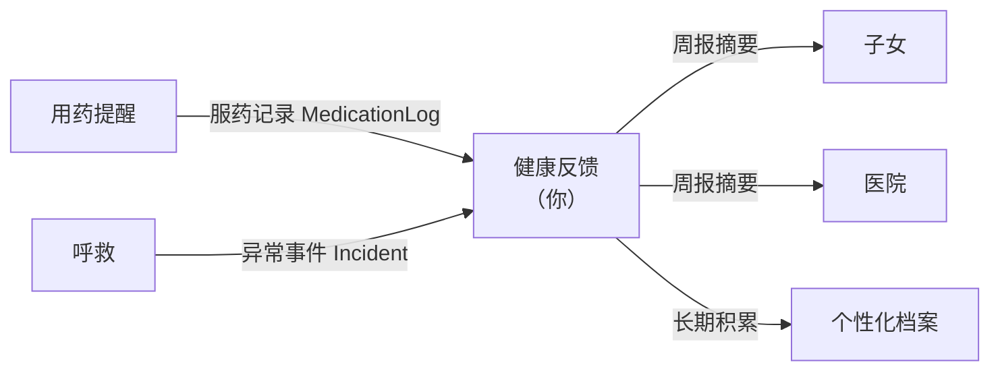

# 健康和照顾反馈 skill（负责人：队友 B）

> 你的代码只写在 `skills/health_report/` 这个文件夹里。
> 不要改 `common/`、不要改别人的 skill，**尤其不要 import 别人的私有模块**（见第六节）。

---

## 一、你要实现的功能

来自项目规划：

> 第三个功能就是每周老人的行为记录，生成一个摘要反馈给医院和子女，自动建立一个个性化档案。

拆成三件事：

1. **每周行为记录** —— 汇总老人这一周做了什么
2. **生成摘要 → 反馈给医院和子女**
3. **自动建立个性化档案** —— 长期积累的老人画像

---

## 二、⚠️ 先说最关键的：你是「下游」

你的 skill 和另外两个**不是平行关系**，你依赖他们的产出：



**这意味着**：你不能自己造数据，你只能**消费**别人产出的数据。

所以你要做的是：
- ✅ 从共享事件流读 `MedicationLog` 和 `Incident`
- ❌ 不要 `from skills.medication_reminder.store import ReminderStore` 去读别人的私有文件

后者看起来能用，但只要用药提醒组改一下存储结构，你的代码就崩了——这是最典型的耦合事故。

> 🔴 **开工前必须确认**：共享事件流存在哪里、用什么接口读。
> 这个还没定（`common/domain.py` 里是草案）。**先找组长和你另外两个队友把这件事定下来再动手**，
> 否则你会写出一堆要返工的代码。

---

## 三、必备文件（照 `medication_reminder/` 的样子建）

```
skills/health_report/
├── __init__.py      # 导出你的 Skill 类
├── schema.py        # 参数模型 + 校验规则
├── executor.py      # 业务逻辑（汇总统计 + 生成文案）
├── messages.py      # 话术（周报是正式语气，不是口语！）
└── skill.py         # 继承 BaseSkill，填 ACTIONS，实现 execute
```

---

## 四、必须遵守的约定

```python
from common import BaseSkill, RiskLevel, SkillContext, SkillResult
from common.domain import Person, MedicationLog, Incident, Notification, NotifyTarget
```

| 约定 | 说明 |
|---|---|
| 类属性 `name` | 固定填 `"health_report"`，**定了就不能改** |
| `display_name` | `"健康和照顾反馈"` |
| `risk_level` | 建议 `RiskLevel.LOW`（周报是只读汇总，没有副作用） |
| `ACTIONS` | `{action名: 参数模型}`，每个字段**必须写 `description`** |
| `execute()` | 必须返回 `SkillResult`，**绝对不要抛异常** |
| 念给老人的话 | 走 `SkillResult.speech`；**发给医院/子女的正式文案走 `Notification.body`，两者不一样** |
| `followup_for(action, exc, field_name)` | 签名照抄 |

---

## 五、Action 设计建议

| action | 触发话术 | 必填参数 | 说明 |
|---|---|---|---|
| `generate_weekly` | 「这周我表现怎么样」 | 老人 ID、周起始日 | 生成周报（可预览） |
| `send_report` | 「把周报发给医生/我儿子」 | 老人 ID、周起始日、接收方 | 走 `Notification` |
| `query_archive` | 「我上个月吃药怎么样」 | 老人 ID、时间范围 | 查个性化档案 |
| `query_summary` | 「我这周吃药按时吗」 | 老人 ID | 快速问答，当场答老人 |

### 周报里该统计什么（建议）

| 指标 | 数据来源 |
|---|---|
| 服药依从率（本周按时服药 X/Y 次） | `MedicationLog` |
| 漏服次数与具体药名 | `MedicationLog`（`status=MISSED`） |
| 异常事件次数（呼救/跌倒） | `Incident` |
| 与上周对比的变化趋势 | 上面两项按周聚合 |

---

## 六、⚠️ 特别注意事项

1. **不要 import 别人的私有模块**。
   ❌ `from skills.medication_reminder.store import ReminderStore`
   ✅ 通过共享事件流读取

2. **给老人听的话 ≠ 给医生看的报告**。
   - 给老人：「这周您吃药挺准时的，有两次忘了，下回注意哈。」
   - 给医生：「本周服药依从率 86.7%（13/15），漏服 2 次，均为晚间二甲双胍。」

3. **医疗措辞要谨慎**。你是反馈，不是诊断。
   ❌「老人疑似阿尔茨海默，建议就医」
   ✅「本周出现 3 次漏服，较上周增加 2 次，供医生参考」

4. **隐私**。用药和健康记录是敏感个人信息，周报内容不要出现身份证号、具体住址等。

5. **周报生成不应该失败**。数据不全时给「数据不足」提示，不要报错。

---

## 七、自测清单

- [ ] `python -m pytest tests/ -q` 全绿
- [ ] `python -c "import skills; print([s.name for s in skills.all_skills()])"` 能看到 `health_report`
- [ ] 没有 import 任何 `skills.<别人的 skill>.*`
- [ ] 数据为空时（新老人、没有记录）不崩溃，给出合理话术
- [ ] 周报数字算对（自己造几条假数据验算一遍）

---

## 八、开工第一步

1. 🔴 **先跟组长和两个队友确认共享事件流的读取方式**（这是你的阻塞点）
2. 定下来之后，再复制 `medication_reminder/` 的 5 个文件开始改造
3. 先用假数据把「生成周报」跑通，再接真实数据源
